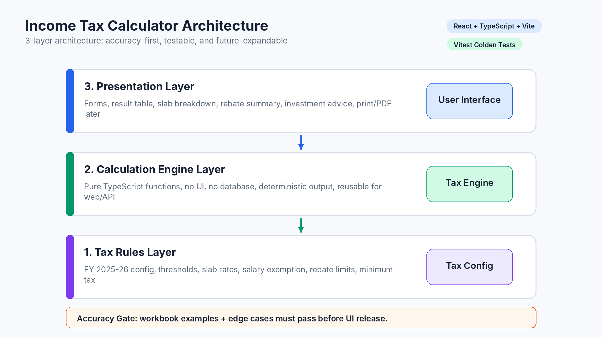
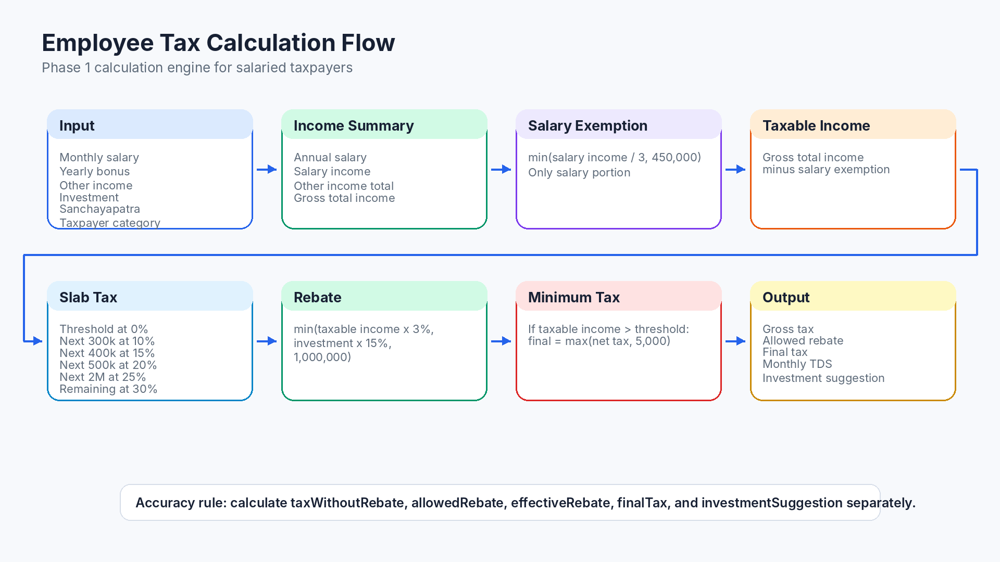
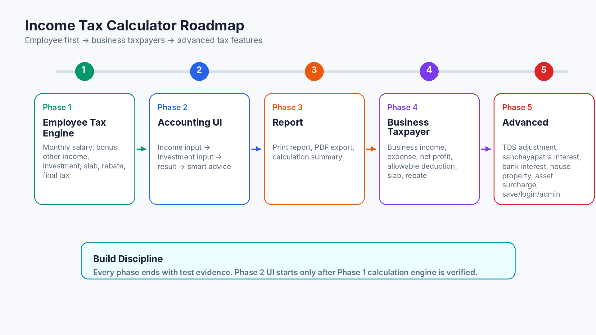

# Income Tax Calculator — Architecture & Development Plan

**Project Type:** Bangladesh Income Tax Calculator  
**Initial Scope:** চাকরিজীবী / Employee Tax Assessment Calculator  
**Tax Year:** FY 2025-26  
**Assessment Year:** AY 2026-27  
**Primary Goal:** হিসাব যেন নিখুঁত হয়, test দিয়ে verify করা যায়, এবং পরে ধাপে ধাপে ব্যবসায়ী ও advanced tax module যোগ করা যায়।

---

## 1. Main Principle

এই project-এর সবচেয়ে গুরুত্বপূর্ণ rule:

```text
আগে tax-engine বানাবো।
তারপর test লিখবো।
তারপর UI বানাবো।
```

UI আগে বানালে দেখতে সুন্দর হবে, কিন্তু হিসাব ভুল হতে পারে। Engine আগে বানালে হিসাব locked থাকবে, পরে design যত ইচ্ছা improve করা যাবে।

---

## 2. Recommended Tech Stack

| Layer | Technology | Purpose |
|---|---|---|
| Frontend | React + TypeScript + Vite | Fast, clean, maintainable UI |
| Styling | Tailwind CSS | Clean accounting-style design |
| Calculation Engine | Pure TypeScript Functions | UI/backend থেকে আলাদা, testable calculation |
| Validation | Zod | Wrong/empty/negative input control |
| Testing | Vitest | Workbook example + edge case automated test |
| Storage v1 | No database | প্রথমে calculation accuracy focus |
| Future Backend | Node.js/Express অথবা PHP API | Report save, login, admin later |
| Future Database | MySQL | Saved calculation, users, admin panel later |

---

## 3. Architecture Decision

Project ৩টা major layer-এ ভাগ হবে:

```text
1. Tax Rules Layer
   - rates
   - slabs
   - thresholds
   - rebate limits

2. Calculation Engine Layer
   - pure functions
   - no UI
   - no database
   - testable

3. Presentation Layer
   - form
   - result table
   - explanation
   - investment advice
```

### Diagram 1 — Layered Architecture



---

## 4. Development Sequence

## Phase 1 — Employee Tax Engine

প্রথমে শুধু হিসাব।

### Input

```text
monthly salary
yearly bonus
other income
investment
sanchayapatra
taxpayer category
```

### Output

```text
salary income
salary exemption
taxable income
slab breakdown
gross tax
rebate
final tax
monthly TDS
investment suggestion
```

### Phase 1 Rule

Phase 1-এ UI design priority না। এখানে priority:

```text
Calculation accuracy
Workbook examples pass
Edge case handling
Clear output object
```

---

## Phase 2 — UI

তারপর frontend তৈরি হবে।

```text
Step 1: Income input
Step 2: Investment input
Step 3: Result
Step 4: Smart advice
```

UI হবে clean, accounting-style, যেন অফিসে ব্যবহার করা যায়।

### UI Sections

```text
Income Summary
Salary Exemption Summary
Slab Breakdown Table
Rebate Summary
Final Tax Summary
Investment Advice
```

---

## Phase 3 — Report

চাকরিজীবী calculator stable হলে report module add হবে।

```text
Print report
PDF export
Calculation summary
```

Report-এ থাকবে:

```text
Input summary
Taxable income calculation
Slab breakdown
Rebate calculation
Final payable tax
Monthly TDS
Investment suggestion
```

---

## Phase 4 — Business Taxpayer

চাকরিজীবীদের হিসাব perfect হলে ব্যবসায়ীদের module শুরু হবে।

```text
business income
expense
net profit
allowable deduction
slab
rebate
minimum tax
```

এই phase-এ employee tax engine modify করা হবে না। নতুন module আলাদা হবে।

---

## Phase 5 — Advanced

পরে advanced features add করা যাবে।

```text
TDS adjustment
sanchayapatra interest
bank interest
house property income
asset surcharge
return-ready summary
database save
login
admin panel
```

---

## 5. Calculation Flow

### Diagram 2 — Employee Calculation Flow



Core calculation flow:

```text
Input
↓
Income Summary
↓
Salary Exemption
↓
Taxable Income
↓
Slab Tax
↓
Investment Rebate
↓
Minimum Tax Check
↓
Final Tax + Monthly TDS + Investment Suggestion
```

---

## 6. Suggested Folder Structure

```text
income-tax-calculator/
│
├── src/
│   ├── tax-engine/
│   │   ├── config/
│   │   │   └── bd-tax-2025-26.ts
│   │   │
│   │   ├── types/
│   │   │   └── tax-types.ts
│   │   │
│   │   ├── calculators/
│   │   │   ├── salary-income.ts
│   │   │   ├── salary-exemption.ts
│   │   │   ├── slab-tax.ts
│   │   │   ├── investment-rebate.ts
│   │   │   ├── minimum-tax.ts
│   │   │   └── employee-tax-calculator.ts
│   │   │
│   │   ├── suggestions/
│   │   │   └── investment-suggestion.ts
│   │   │
│   │   └── utils/
│   │       ├── money.ts
│   │       └── rounding.ts
│   │
│   ├── components/
│   │   ├── TaxInputForm.tsx
│   │   ├── IncomeSummary.tsx
│   │   ├── SlabBreakdown.tsx
│   │   ├── RebateSummary.tsx
│   │   ├── FinalTaxSummary.tsx
│   │   └── InvestmentAdvice.tsx
│   │
│   ├── pages/
│   │   └── EmployeeTaxCalculator.tsx
│   │
│   └── App.tsx
│
├── tests/
│   ├── salary-exemption.test.ts
│   ├── slab-tax.test.ts
│   ├── rebate.test.ts
│   ├── minimum-tax.test.ts
│   └── workbook-examples.test.ts
│
└── package.json
```

---

## 7. Tax Rules Layer

Tax rules hard-code করা যাবে না। সব rate/config আলাদা file-এ থাকবে।

```ts
export const bdTax2025_26 = {
  assessmentYear: "2026-27",

  thresholds: {
    general: 375000,
    female_or_senior: 425000,
    disabled_or_third_gender: 500000,
    freedom_fighter_or_july_warrior: 525000,
  },

  salaryExemption: {
    rate: 1 / 3,
    maxAmount: 450000,
  },

  slabsAfterThreshold: [
    { amount: 300000, rate: 0.10 },
    { amount: 400000, rate: 0.15 },
    { amount: 500000, rate: 0.20 },
    { amount: 2000000, rate: 0.25 },
    { amount: Infinity, rate: 0.30 },
  ],

  investmentRebate: {
    taxableIncomeRate: 0.03,
    investmentRate: 0.15,
    maxAmount: 1000000,
  },

  minimumTax: 5000,
};
```

---

## 8. Calculation Engine Input

```ts
type EmployeeTaxInput = {
  taxpayerCategory:
    | "general"
    | "female_or_senior"
    | "disabled_or_third_gender"
    | "freedom_fighter_or_july_warrior";

  monthlySalary: number;
  yearlyBonus: number;

  otherIncome: {
    source: string;
    amount: number;
  }[];

  investments: {
    type: string;
    amount: number;
  }[];

  alreadyPaidTax?: number;
};
```

---

## 9. Calculation Engine Output

```ts
type EmployeeTaxResult = {
  income: {
    monthlySalary: number;
    annualSalary: number;
    yearlyBonus: number;
    salaryIncome: number;
    otherIncomeTotal: number;
    grossTotalIncome: number;
    salaryExemption: number;
    taxableIncome: number;
  };

  slabBreakdown: {
    label: string;
    amount: number;
    rate: number;
    tax: number;
  }[];

  tax: {
    grossTaxBeforeRebate: number;
    totalInvestment: number;
    allowedRebate: number;
    effectiveRebate: number;
    netTaxAfterRebate: number;
    minimumTax: number;
    finalTax: number;
    taxWithoutRebate: number;
    taxSavedByRebate: number;
    monthlyPayrollTds: number;
  };

  investmentAdvice: {
    maxRebateByIncome: number;
    requiredInvestmentForFullRebate: number;
    currentInvestment: number;
    additionalInvestmentNeeded: number;
    possibleAdditionalRebate: number;
    actualAdditionalTaxSaving: number;
  };
};
```

---

## 10. Accuracy Strategy

হিসাব ভুল হওয়ার risk কমাতে ৫টা rule follow করা হবে।

### 10.1 Pure Function Only

Calculation engine কোনো UI state, database, browser, localStorage dependency রাখবে না।

```text
Same input = same output
```

### 10.2 Integer Money

টাকা integer হিসেবে ধরা হবে। Floating point error কমাতে calculation controlled rounding দিয়ে হবে।

```text
100000 = 1,00,000 টাকা
```

### 10.3 Golden Tests

Workbook-এর example এবং practice problem automated test হবে।

```text
Example 1
Example 2
Example 3
Example 4
Example 5
P1
P2
P3
```

### 10.4 Edge Case Tests

```text
income below threshold
income exactly threshold
income just above threshold
zero investment
large investment
rebate larger than gross tax
minimum tax case
female/senior threshold
sanchayapatra + other investment
```

### 10.5 Release Gate

```text
All tests pass না করলে calculator release করা যাবে না।
```

---

## 11. Roadmap Diagram

### Diagram 3 — Project Roadmap



---

## 12. Final Build Discipline

এই project-এর কাজের order হবে:

```text
1. Rules config
2. Types
3. Small calculator functions
4. Main employee tax calculator
5. Workbook tests
6. Edge case tests
7. UI form
8. Result table
9. Investment advice
10. Print/PDF report
```

সবচেয়ে গুরুত্বপূর্ণ: **হিসাব আগে, design পরে।**
